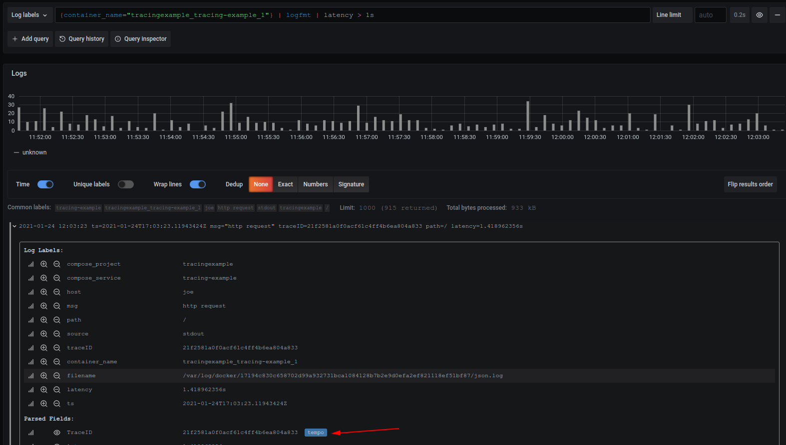

# tempo-otel-example

This example shows a mixture of otel and prometheus instrumentation in go.  It includes trace discovery through logs and exemplars.

1. Install Loki Docker Driver

`docker plugin install grafana/loki-docker-driver:latest --alias loki --grant-all-permissions`

2. Build the application and start everything up.

`./build.sh`

3. Exercise the application.

`curl http://localhost:8000/`

4. (Optional) See OpenMetrics Exemplars.

`curl -H 'Accept: application/openmetrics-text' http://localhost:8000/metrics | less`

5. Discover Traces

- Navigate to http://localhost:3000/explore
- Go to the explore page
- Choose the prometheus datasource and execute `histogram_quantile(.99, sum(rate(demo_request_latency_seconds_bucket[1m])) by (le))`

- Choose the Loki datasource and execute `{container_name="tracingexample_tracing-example_1"} | logfmt | latency > 1s`

